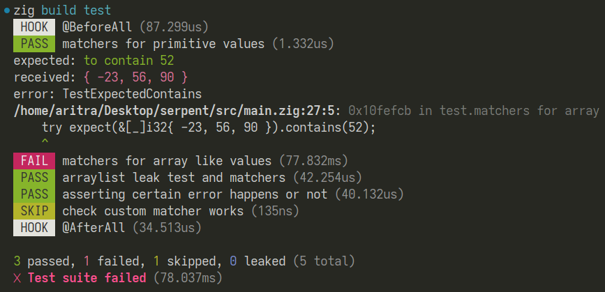

# 🐍 Serpent Testing Framework

A sophisticated test runner for [zig](https://ziglang.org/), with extra features and modern aesthetics.

* Colored output logs
* Supports hooks like `@BeforeAll` and `@AfterAll`
* Bail tests early
* Time record for each test
* Pluggable into any existing project
* Comes with `expect(...).equals(...)` type matchers



## Installation

> Serpent follows latest zig master branch, but should work in older zig versions too.

### For zig projects,

1. Fetch the package.

   ```bash
   zig fetch --save git+https://github.com/tr1ckydev/serpent
   ```
2. Import the module in `build.zig`.

   ```zig
   const serpent_mod = b.dependency("serpent", .{}).module("serpent");
   ```
3. Switch to `serpent` as your new test runner by adding the following line to any `b.addTest(...)`.

   ```diff
   const exe_unit_tests = b.addTest(.{
       .root_module = exe_mod,
   +   .test_runner = .{ .path = serpent_mod.root_source_file.?, .mode = .simple },
   });
   ```

   > [!TIP]
   >
   > To switch back to the default test runner, simply comment the above line you just added.
   >
4. (Optional) To use the `expect(...).equals(...)` type matchers in your project, add it to your exe module.

   ```zig
   // in build.zig
   exe_mod.addImport("serpent", serpent_mod);

   // in main.zig
   const s = @import("serpent");
   ```

### For single zig files,

1. Clone this repository.

   ```bash
   git clone --recurse-submodules https://github.com/tr1ckydev/serpent
   ```
2. Pass the test runner path when using `zig test`.

   ```bash
   zig test --test-runner ./serpent/src/root.zig <path_to_your_zig_file>
   ```

## Usage

Serpent is divided into two parts — the **test runner** and the **expect matchers**.

Both are independent of each other. You could just swap the default test runner with the serpent test runner while just using `std.testing.*` expect functions. Or you could just keep the default test runner and only import the serpent module in your tests to take advantage of the matchers. Or you could do both, even better.

Check out the documentation for more details.

## Credits

Serpent Testing Framework is inspired by quite a few projects, I would like to thank each one of them.

- [Bun test runner](https://bun.sh/docs/cli/test)
- [Jest test runner](https://jestjs.io/)
- [Karl Seguin's custom test runner](https://gist.github.com/karlseguin/c6bea5b35e4e8d26af6f81c22cb5d76b)

## License

This zig package repository is licensed under the MIT License. Please see [LICENSE](https://github.com/tr1ckydev/serpent/blob/main/LICENSE) for full license text.
